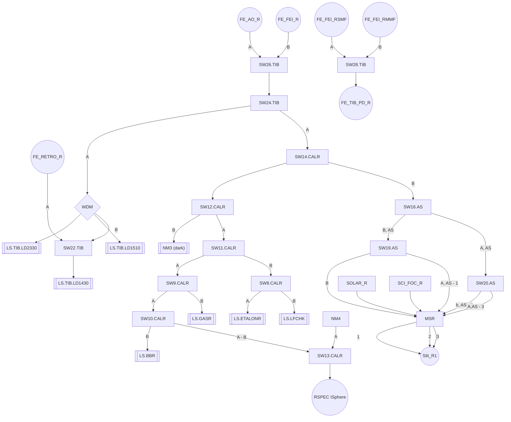

Jeb 8/8/25
[Github](https://github.com/CaltechOpticalObservatories/hispec-fib/tree/ca401c7ef48cedd943ba40b357479d3defb89800) TODO: This doc needs to be added to this repo git. 
## Overview
HISPEC's fiber subsystem, FIB, deals with routing science and calibration light throughout the instrument. There are 7 controllable components:
1. The Trunk Interface Box (TIB), located in the Keck dome beneath the Nasmyth platform on a standard access platform.
2. The CAL B Fiberswitch, in a rack mount enclosure in the B Calibration rack,
3. The CAL R Fiberswitch, in a rack mount enclosure in the R Calibration rack
4. The Achromatic Splitter, in a rack mount enclosure in the Main Switch Rack, the AS handles both B and R channels
5. The Blue Main Switch, in the Main Switch Rack
6. The Red Main Switch, in the Main Switch Rack
7. A raspberryPi that hosts the Blue and Red Main Switch's USB web cameras (see below, in the Main Switch Rack

The first four of these components are variations of a single PCB with an embedded, networked microcontroller, each with slight variations in supported software functionality. The latter two each consists of a vendor supplied custom PLC and a pair of fiber tip imaging cameras -- essentially oddly shaped webcams. 

Logical functionality of the FIB, e.g. "get light from source X to fiber tip Y" or "route and monitor light from calibration laser X on FEI focus Y", generally depends on configuring the state of multiple components within FIB and, in cases such as FEI calibration, correct functioning can not even be ascertained without cutting across HISPEC subsystems. 

Broadly the system must expose:
- Get source(s) of [output] fiber end
- Connect fiber end X to fiber end Y
- Inspect mechanical switch fiber X
- Clean mechanical switch fiber end X
- Monitor uncalibrated flux at fiber using illumination Y

Really should expose:
- Tell if switch X impacts end Y
- Tell if switch X can ever impact end Y
- Tell if light at end X impacts end Y
- Monitor calibrated flux at fiber using illumination Y

And could helpfully expose (with coordination of other subsystems):
- Calibrate LD power
- Calibrate Attenuator

## Fiber Inputs
- B/R Focus
- B/R SMPD
- B/R MMPD
- B Lantern
- B/R FEI CAL
- B/R SPEC CAL
- B/R Solar
## Fiber Outputs
- B/R AO Output
- B/R FEI Output
- B/R Spec 1/2/3
- B/R Retro

## Fiber Ends
These fiber ends are intermediate in the system and thus both outputs and inputs depending on the relative point of consideration.
- B/R Achromatic Out 1/2/3
- B/R Achromatic In

## Fiber Interdependencies
These interdependencies are determined via inspecting the fiber schematic, they are in the format of fiber end (FE_...): list of ordered list of switches (SW##\_[A|B].LOCATION) affecting the end. The underscore \_A/B after the switch number indicates the state the switch must be in for the remainder of the path to be relevant. NM# is a Narcissus mirror (a "source" of darkness). LS stands for a lightsource, some fiber ends may be serviced by multiple light sources AND other switches simultaneously. 



## Control Needs
### Embedded Controllers
Each of the embedded controllers exposes a common MQTT interface with endpoints following the Amazon IoT developer guidelines modified for clearer integration with ongoing development wort on the mKTL communication protocol and library (c.f. K. Lanclos, P. Gupta, J. Bailey, others). The embedded codebase is in C and developed within the Zephyr development ecosystem. Code for the boards heavily shared across all four boards and is identical between the two CAL fiber switches. It is intended that the controllers are receiving NTP and thus able to be interacted with in a reasonably time-synchronized manner. 
Planned control endpoints are as below, MQTT paths will be added as decisions are made:
#### CAL Fiberswitch, AS, and TIB
- get/set light route - Configure a path for light through the switch assembly. This will fail if the path is not physically attainable (i.e. there is no path from X to Y). It may invalidate a previous activated path as not all paths can co-exist. 
- get/set switch - Configure the state of a switch (i.e. in/output of switch X to position A/B)
- get status - Get a detailed status report
- get PCB temp - Get the temperature of the PCB
#### TIB Fiberswitch Only
- get/set laser setting - Configure a calibration laser setting.
- get/set laser attenuator amount - Configure the amount of attenuation on a calibration laser. This setting will support both raw, uncalibrated units and calibrated units. There will be an associated command to update the unit conversion curve.
- get/set tib power - Turn on of off the higher power portions of the TIB. Note that the TIB controller will automatically manage power as it sees fit and will power itself down unless sleep is disabled. 
- get/set photodiode - Configure the photodiodes that monitor the B and R fibers from the FEI. The details of this command are not fully resolved. The photodiodes do not have any inherent configurability and ultimately we may elect to simply continuously publish raw data at either a fixed or selectable sampling rate. Presently thinking is that calibration curves from raw to flux, stream start/stop, and one-shot readings will all be supported under this endpoint.  
#### Achromatic Splitter Only
- get/set splitting ratio [b, r] - Configure the amount of light to divide between the R or B splitter outputs.
- get/set splitting timeout [b, r]- Configure the splitting timeout. the slitting ratio must be set more frequently than this to maintain splitting. After timeout from a set splitting call splitting will discontinue and the input will route out through the calibration (non-split) port 
### Embedded Daemon Duals
Presently mKTL is still evolving and it is not yet clear if there will be a facility MQTT-ZMQ transport bridge. If such a bridge existed we could, in theory, omit any daemons related exclusively to these controllers. The present absence of this bridge necessitates FIB (HISPEC) hosting an MQTT (e.g. Eclipse Mosquitto) broker and mKTL bridge. 

One of the guiding ICS philosophies throughout HISPEC, LRIS2, and ZShooter is a default of one os level daemon per device, though what constitutes a device can be situational. To help ensure that each of the embedded systems is operational in the mKTL sphere and to facilitate phased testing and AIV we elect to create a suite of 5 daemons:
- An Eclipse Mosquitto or equivalent broker
- Four relay daemons, one per embedded board (cf. sheet [Services](https://caltech.sharepoint.com/:x:/r/sites/coo/hispec/Shared%20Documents/HISPEC%20-%20Subsystems%20%5BL3%5D/Software%20Subsystem%20%5BICS%5D/Devices,%20Services,%20and%20Daemons.xlsx?d=w651bfd87d5154ce7b796b8d7e0bd5b50&csf=1&web=1&e=LGbdGG))
	- calfiberswitch r
	- calfiberswitch b
	- acromaticfiberswitch
	- trunkfiberbox
#### mKTL Keys
- Cal Switches
	- hs.fib.cs[b,r].route - Query or activate a route through the switch
	- hs.fib.cs[b,r].switch - get/set state of a specific switch
	- hs.fib.cs[b,r].status - overall status
	- hs.fib.cs[b,r].temp - temperature
- Achromatic Splitter
	NB: It might be wise to alias status and temp to "as[b,r]" keys or move the [b, r] to the final key suffix for split and switch. Unclear what least confusing/ most predictable path is. There is only one achromatic splitter and it services both channels. 
	- hs.fib.as[b,r].split - split the light in a ratio of (a,b,c)
	- hs.fib.as[b,r].switch - get/set state of a specific switch, setting will always deactivate splitting, getting is rarely meaningful
	- hs.fib.as.status - overall status
	- hs.fib.as.temp - temperature
- TIB Controller
	It is likely we will have additional keys related to the calibration of or HISPEC's calibration processes that employ the lasers, attenuators, and photodiodes. In essence the controller may offer a scaled system that dynamically combines laser power, attenuation and raw photodiode readings to deliver a larger effective dynamic range. 
	- hs.fib.tib.route - Query or activate a route through the switch
	- hs.fib.tib.switch - get/set state of a specific switch
	- hs.fib.tib.status - overall status
	- hs.fib.tib.temp - temperature
	- `hs.fib.tib.foreaft_feed[r,b](fore, aft, fore_flux, aft_flux)` - Feed 1430 laser light either forward or backwards through the FEI. If both values are non-zero light will be temporally muxed between the selected forward feed and the retro feed. 0 <= fore+aft <= 1. fore and aft are independently quantized into units of 0.02 prior to asserting they sum to no more than unity. Note that for forward light to be seen the laser/cal selector switch must not be set to CAL light. Selection of the forward injection point (AO, FEI) must be done via setting its switch.
	- hs.fib.tib.monitor_flux - stream out the flux from the requested photodiode input (MMR, MMB, SMR, SMB)
	- hs.fib.tib.retrofeed - Feed the retro fibers for the R of B focus with an amount of light. may disconnect 1430 nm light from forward injection.
	- hs.fib.tib.laser.  - related to direct control of the 6 lasers 
	- hs.fib.tib.atten. - related to direct control of the attenuation independently applied to each of the lasers
	- hs.fib.tib.photodiode_[r,b] - related to the monitoring photodiodes
### Main Switch
HISPEC's mechanical fiber switcher's connect the three fibers to the spectrograph slit with various permutations of inbound fibers from elsewhere in the system via an internal XY stage. The fiber connections are executed a singular group, independent connection/disconnection of a single slit fiber is physically impossible. Only a subset of input to output connections are supported. The switcher also supports imaging of fiber end faces and cleaning of the same.

The main fiber switches will be serviced by a pair of instances identical daemons, `mainfiberswitch`. This daemon employs a device class that abstracts the main switch PLC into exposing both FIB level switching functionality, AIT interface needs, and implements any additional persistent configuration we will need around the vendor hardware. The daemon also interfaces with the USB fiber imaging cameras for its switch, performing frame grabbing, focusing, and dirt detection functionality. 
The two principal device classes it employs are 

`NB While I intend these listings to be the principal API we do not yet have the hardware`
#### mKTL Keys
Presently a loose listing of primary API, engineering keys will be required.  
- hs.fib.ms[b,r].connection - arg/return named_fiber_input_group
- hs.fib.ms[b,r].connection_policy - set arg: fiber group & policy, get arg: fiber group
- hs.fib.ms[b,r].reference_image(fiber, type) - set is nonstandard usage, type is `throughput` or `dirt_alert`
- hs.fib.ms[b,r].housekeeping(fiber) - set only
- Standard mKTL Daemon keys:  `stop`, `status`. 
NB `start` as an mKTL key serviced by a daemon does not make sense. If a daemon is not running it is unable to start itself. Such a key must be provided by some other daemon/supervisory process. `restart` involves the daemon either making assumptions about the auto-restart nature of its environment or requiring it to extend external hooks in a manner that must play nice with the supervisory process already capable of starting it, so I omit it.
#### Daemon's Device Class Model
##### MechanicalSwitch
- config_xxxx - get/set a config param, e.g. speeds, set points, low-level switching motion behaviors
- connect_input_group  - connect spectrograph fibers to input group
- inspection_position - move to the inspection position
- clean - perform a cleaning
- air_control - Placeholder for control of positive pressure air system 
- status - eponymous
##### MechanicalSwitchCamera
NB, this could be hived off into a discrete InspectionController Daemon, but I'm disinclined at present -Jeb
- refocus - eponymous
- light - configure the light
- detector_settings - configure the detector
- capture - grab an image
##### MechanicalSwitchController
- inspect_and_clean - Perform an inspection of fiber ends. Look for dirt. Archive the image. Alert as per policy.
- connection_policy - get/set connection policy for a particular port, such as cleaning frequency, imaging policy, dirt thresholds for alerts, reference images, camera settings
- select_input - Connect the input to the spectrograph per connection policy
- inspection_image - get the most recent or reference inspection image for a fiber
- take_reference_image - take a reference image of a fiber end
### Lightpath Daemon
This daemon exists to expose a cohesive interface to routing light through HIPSEC's fibers. Since it does not make requests of any FEI components it is unable to fully control light routing through HISPEC. 
#### mKTL Keys
Presently a loose listing of primary API, engineering keys will be required.  
- hs.fib.route - configure the system such that light (or dark) entering at A as routed to B, for routes involving achromatic splitting a splitting ratio is required. Gets specifying A and B indicate if the route is connected. Gets specifying either A or B result in what presently sinks or sources A/B. Sources is not guaranteed to be singular.
- hs.fib.switch - set a switch
- Standard mKTL Daemon keys: `stop`, `status`. 
## Failure modes
There are several potential failures in the system. The FIB system is capable of self-detecting:
- LD failure
	- IO Error
	- Some Hardware Faults, though it is plausible there exists diode failures that are not detectable via the driver and embedded controller. 
- Mechanical Switchers 
	- PLC reported fault codes, vendor dependent
	- Dirty fiber via inspection
	- IO fault to fiber camera or PLC
	- Inspection camera device faults
- Offline status of any embedded controller
- MQTT broker offline
- TIB Large Core Switch HW fault
- TIB no photodiode signal

At the ICS system level additional failures can be detected, checking these failures generally requires both configuring other portions of the system (e.g. the FEI's light path) *and* knowing expected windows or values of measurements. Many of these could also be explained by fiber damage and there is no straightforward way to disentangle the two. 
- TIB Laser Attenuator failure
	- incompatible flux (low/high) detected given laser & atten settings
- TIB PD failure, via
	- increased noise
	- no/wildly unrealistic level
- MEMS switch fault, via
	- flux somewhere it shouldn't be
	- no/low flux at spectrograph or photodiode, depending on relevant path
- Mechanical Switch, via
	- spectrograph seeing flux from an "unselected" source
	- no/low flux at spectrograph
# The LightPath Manager
The Lightpath Manager maintains a data structure of key components in HISPEC's optical train that includes its light sources (e.g. laser diodes, lamps), detectors (photodioes, the ATC camera, and the yj and HK spectrographs), and many of the freespace optical (dichroics, splitters, masks) and fiberoptic components (fibers, fiber switches, WDMs, variable attenuators) that influence the light path. 

It includes all of components that are configurable and facilitates direct inspection of their state.

Loosely:
```python

### Using synphot for the actual source emissions, transmitted spectra, transmission curves/bandpasess, and such... 
from synphot import SpectralElement
from synphot.models import GaussianFlux1D, Box1D

class FiberComponent:
	""" 
	has a name
	has a transmission curve
	has 1 or more ends, each either an input or output and each woth an associated coupling transmission curve that defaults to unity
	combines light from the inputs and distributes it to the outputs per some component specific function (i.e. a WDM sums the light from the inputs and outputs it, a splitter divides the light from the input among the outputs) 
	"""
	pass
	
class Fiber(FiberComponent):
	"""
	A FiberComponent with one input and one output
	"""
	pass

class FiberSwitch(FiberComponent):
	"""
	A FiberComponent with either two inputs (A, B) and one output, C, or two outputs (A, B) and one input, C.
	It has a controllable state that selects whether A and C are connected or B and C are connected. 
	"""
	pass

class VariableAttenuator(Fiber):
	""" A fiber that has a controllable voltage that increases or decreases the amount of transmission """
	pass

class Source:
	"""
	- has a name
	- has one output
	- sources take a drive level (e.g. current, percentage on)
	- emits a spectrum or model
	"""
	pass

class Optic:
	"""
	has at least a name
	"""
	pass

class OpticalBeam(Optic):
	"""
	Has one or more inputs
	Has one output
	Sums the inputs into the output
	"""
	pass

class Dichroic(Optic):
	"""
	- has three ports
	- each port has a transmission curve to each other port
	- each port has an input
	- each port has an output
	"""
	pass

class Selector(Optic):
	"""
	Contains some number of items of the same type
	Has the inputs and outputs of the items it contains
	The inputs connect to the inputs of the selected item and the outputs connect to the outputs of the selected item.
	For example this can be used to select between four different Dichroics or between 3 different filters
	"""
	pass

class Filter(Optic):
	"""
	- Has two ports
	- has a transmission curve that applies to both ports
	- each port has an input
	- each port has an output
	"""

class Detector:
	""" has at least a name """
	pass

class Photodiode(Detector):
	"""
	- has one input
	- has an integration time
	- has a read noise
	- has a saturation level
	- has an efficiency curve that is a function of wavelength
	- converts light to an ADU with a variance
	"""
	pass
	
class Imager(Detector):
	"""
	- has one input
	- has a PSF
	- has an integration time
	- has a read noise
	- has a dark current
	- has a saturation level
	- has an efficiency curve that is a function of wavelength
	- distributes light to pixels according to its PSF
	- converts light to an ADU image and variance image
	"""
	pass

class Spectrograph(Detector):
	"""
	- has one input
	- has a PSF and dispersion relation
	- has an integration time
	- has a read noise
	- has a dark current
	- has a saturation level
	- has an efficiency curve that is a function of wavelength
	- distributes light to pixels according to its PSF and dispersion relation
	- converts light to an ADU image and variance image
	"""
	pass
	
class Lightpath:
	def __init__(...):
		self.switches : dict = {}
		self.detectors : dict = {}
		self.sources : dict = {}
		self.selectors : dict = {}
		self.fibers : dict = {}
		self.attenuators : = {}
		self.beams : dict = {}
		self.optics : dict = {}
		...
	...	
```

The connectivity map is:
- Source 1028 nm laser -> VariableAttenuator 1028 -> WavelengthDivisionMultiplexer  yj input 1
- Source 1270 nm laser -> VariableAttenuator 1270 -> WavelengthDivisionMultiplexer  yj input 2
- Source yj 1430 nm laser -> VariableAttenuator 1430 yj -> Switch yj retro C in port
- Switch yj retro A out port -> WavelengthDivisionMultiplexer yj input 3
- Switch yj retro B out port -> Fiber yj retro
- WavelengthDivisionMultiplexer yj output -> Switch yj fei feed C in port
- Switch yj fei feed A out port -> Fiber yj ao  -> OpticalBeam AO input beam -> Filter AO losses -> OpticalBeam fei input beam
- Switch yj fei feed B out port -> Fiber yj fei  ->  OpticalBeam fei input beam


- OpticalBeam fei input beam -> Selector atc dichroic selector A in
- Selector atc dichroic selector
	- J dichroic
	- H dichroic
	- JH dichroic
	- JHgap dichroic
- Selector atc dichroic selector B out -> Imager ATC 
- Selector atc dichroic selector C out -> Dichroic csd A in 
- Dichroic csd A out -> Selector atc dichroic selector C in
- Dichroic csd B out -> Selector yj piaa in -> Selector yj focus in
- Selector yj piaa out -> Selector yj focus
- Selector yj piaa reverse out ->  Dichroic csd B in
- Selector yj piaa
	- Filter yj piaa high
	- Filter yj piaa low
	- Filter yj vortex
	- Filter yj clear
- Selector yj focus
	- Fiber yj mmf pd
	- Fiber yj smf pd
	- Fiber yj science
	- Fiber yj retro
- Fiber yj mmf pd -> Switch yj pd B in
- Fiber yj smf pd -> Switch yj pd A in
- Switch yj pd C out -> Photodiode yj pd
- Fiber yj retro -> Selector yj piaa reverse in
- Fiber yj science -> Spectrograph BSPEC
- Dichroic csd C out -> Selector hk piaa in -> Selector hk focus in
- Selector hk piaa out -> Selector hk focus
- Selector hk piaa reverse out ->  Dichroic csd C in
- Selector hk piaa
	- Filter hk piaa high
	- Filter hk piaa low
	- Filter hk vortex
	- Filter hk clear
- Selector yj focus
	- Fiber hk mmf pd
	- Fiber hk smf pd
	- Fiber hk science
	- Fiber hk retro
- Fiber hk mmf pd -> Switch hk pd B in
- Fiber hk smf pd -> Switch hk pd A in
- Switch hk pd C out -> Photodiode hk pd
- Fiber hk retro -> Selector hk piaa reverse in
- Fiber hk science -> Spectrograph RSPEC